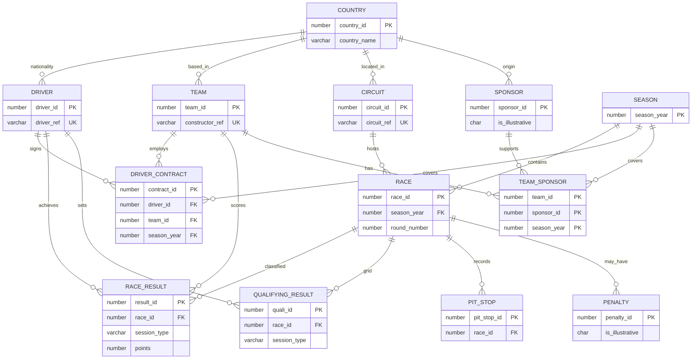

# Entity-relationship diagram

```mermaid
erDiagram
  COUNTRY ||--o{ DRIVER : nationality
  COUNTRY ||--o{ TEAM : based_in
  COUNTRY ||--o{ CIRCUIT : located_in
  COUNTRY ||--o{ SPONSOR : origin
  SEASON ||--o{ RACE : contains
  SEASON ||--o{ DRIVER_CONTRACT : covers
  SEASON ||--o{ TEAM_SPONSOR : covers
  TEAM ||--o{ DRIVER_CONTRACT : employs
  DRIVER ||--o{ DRIVER_CONTRACT : signs
  CIRCUIT ||--o{ RACE : hosts
  RACE ||--o{ RACE_RESULT : classified
  RACE ||--o{ QUALIFYING_RESULT : grid
  RACE ||--o{ PIT_STOP : records
  RACE ||--o{ PENALTY : may_have
  DRIVER ||--o{ RACE_RESULT : achieves
  DRIVER ||--o{ QUALIFYING_RESULT : sets
  TEAM ||--o{ RACE_RESULT : scores
  TEAM ||--o{ TEAM_SPONSOR : has
  SPONSOR ||--o{ TEAM_SPONSOR : supports

  COUNTRY {
    number country_id PK
    varchar country_name
  }
  SEASON {
    number season_year PK
  }
  TEAM {
    number team_id PK
    varchar constructor_ref UK
  }
  DRIVER {
    number driver_id PK
    varchar driver_ref UK
  }
  DRIVER_CONTRACT {
    number contract_id PK
    number driver_id FK
    number team_id FK
    number season_year FK
  }
  CIRCUIT {
    number circuit_id PK
    varchar circuit_ref UK
  }
  RACE {
    number race_id PK
    number season_year FK
    number round_number
  }
  RACE_RESULT {
    number result_id PK
    number race_id FK
    varchar session_type
    number points
  }
  QUALIFYING_RESULT {
    number quali_id PK
    number race_id FK
    varchar session_type
  }
  PIT_STOP {
    number pit_stop_id PK
    number race_id FK
  }
  PENALTY {
    number penalty_id PK
    char is_illustrative
  }
  SPONSOR {
    number sponsor_id PK
    char is_illustrative
  }
  TEAM_SPONSOR {
    number team_id PK
    number sponsor_id PK
    number season_year PK
  }
```

`RACE` is one Grand Prix weekend. Sprint results live in `RACE_RESULT` with `SESSION_TYPE = 'SPRINT'`, so sprint points never overwrite GP classifications.
